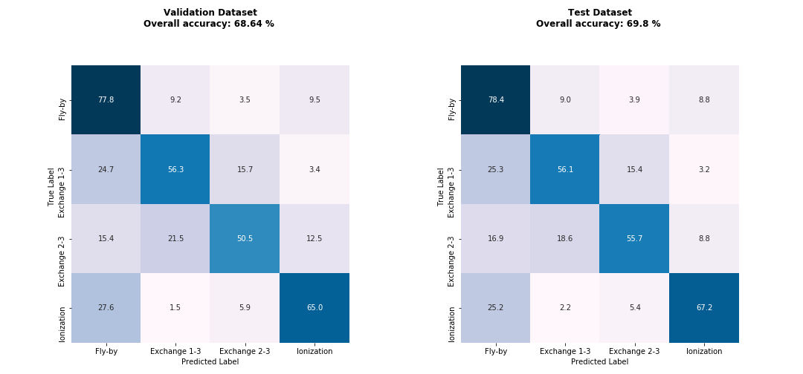
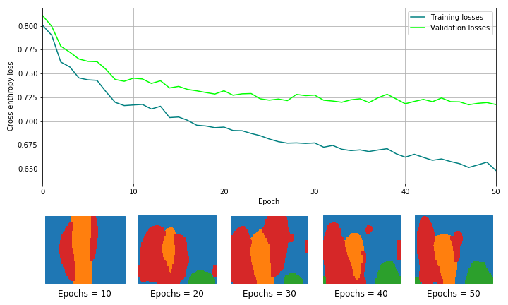

# Analysis of a set of outputs of ARWV with Machine Learning
## Computational Astrophysics Exam Project at UNIPD
***

The aim of the project is to train a fully connected deep neural network on a set of 1e5 simulations of 3 body Black Holes encounters
performed with the code ARWV and to predict the correct outcome.

The 3 body problem has puzzled for centuries physicists and matematichians alike. The chaotic nature of these systems has made it difficult 
to predict the trajectories of objects subject to each others grabitational pulls starting from arbitrary initial conditions.
These comptutation have required considerable resources from the era of Newton all the way to the present day, 
where N-body simulations require intensive investments in time and energy to get accurate results.

This is where the possibility to apply machine learning principles comes in. Since Neural Networks require a finite and predictable amount of linear operations to 
predict a certain outcome, it could be possible to cut computational times by several orders of magnitude if it could be proven that a machine learning algorithm is 
capable of correctly modelling the differential equations that govern gravitational relativistic interactions.

All of the code is available in the [Main notebook](Computaional_astrophysics_project.ipynb), where the machine learnin framework chosen is `pytorch`.

The training data is not yet available but the network parameters are in this repository.

